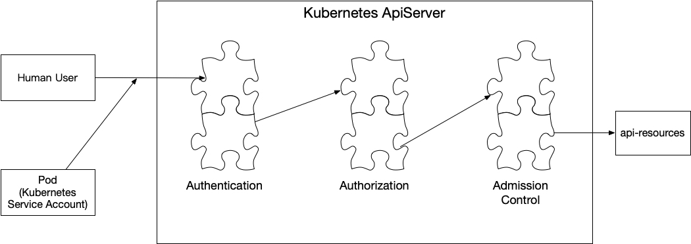

ServiceAccount 用于限制 Pod 的权限，K8s 创建一个 Pod 时会为这个 Pod 赋予一个 ServiceAccount。

<!--more-->

ServiceAccount 属于命名空间资源，每个命名空间默认都会创建一个名为 default 的 ServiceAccount，创建工作负载时如果没有为这个工作负载指定 ServiceAccount 则会把默认的 default 授予给它。创建自定义 ServiceAccount 的简单例子如下：

```sh
$ cat custom-service-account.yml
apiVersion: v1
kind: ServiceAccount
metadata:
    name: custom-service-account
$ kubectl create -f custom-service-account.yml
serviceaccount/custom-service-account created
$ kubectl get serviceaccounts
NAME                     SECRETS   AGE
custom-service-account   1         46s
default                  1         2m21s
```

每个 ServiceAccount 都带有一个 CA 证书文件和一个 Token。

```sh
# 新建的 serviceaccount 中记录了与之对应的 secret 名称
$ kubectl get serviceaccounts/custom-service-account -o yaml
apiVersion: v1
kind: ServiceAccount
metadata:
  creationTimestamp: "2019-11-23T04:21:13Z"
  name: custom-service-account
  namespace: default
  resourceVersion: "670"
  selfLink: /api/v1/namespaces/default/serviceaccounts/custom-service-account
  uid: af96387b-0da8-11ea-9131-000c294c8d1a
secrets:
- name: custom-service-account-token-pfs2v
# 查询这个 secret 拿到 CA 证书文件以及 Token。
$ kubectl get secret custom-service-account-token-pfs2v -o yaml
apiVersion: v1
data:
  ca.crt: LS0tLS1CRUdJTiBDRVJUSUZJQ0FURS0tLS0tCk1JSUN3akNDQWFxZ0F3SUJBZ0lCQURBTkJna3Foa2lHOXcwQkFRc0ZBREFTTVJBd0RnWURWUVFERXdkcmRXSmwKTFdOaE1CNFhEVEU1TVRFeU16QTBNVGcwTTFvWERUSTVNVEV5TURBME1UZzBNMW93RWpFUU1BNEdBMVVFQXhNSAphM1ZpWlMxallUQ0NBU0l3RFFZSktvWklodmNOQVFFQkJRQURnZ0VQQURDQ0FRb0NnZ0VCQUw5QStWQUl6UHRzCklBYXVYMEFYZm9jNjNETU8vQ0NYZVprbkorakJNK2U1SWsxQk52RzR3eFFyaHJySUx5eWM5YmxDYnQyZFVQZU0KUURwdm1kZHNYSU5CWWhTZTZKS2NLbmp5SXl4bGU4QUlGVGlKNlphcEdkUVlYOVNucXBiN1dwOStOcW12di9CVgpGR05ENlUrWG5jZTlidG1uaXE1ZEdoL1kycjdGSVlkaGt3TCs4Y0JxWGJkRVV1bjhuY1dpa2lFMXZybVZZS1BpClpQcjNQaFNKdmJYNkhnbmd1VkJ5dzNQSlFabWpJQjZHcWtOcFA5VTVaY2JELzJIVmNaajdOaEEyWWlMQUN0MnMKMEFxdmlOejJXeXB4TUZuN2RROUhjRmFFVXV6MkM3RVFZdDMrL0g0UnVwU3dEV05YQlcxY1ZEdzZrY2E5dml6TQowN2hISjZWa0JwTUNBd0VBQWFNak1DRXdEZ1lEVlIwUEFRSC9CQVFEQWdLa01BOEdBMVVkRXdFQi93UUZNQU1CCkFmOHdEUVlKS29aSWh2Y05BUUVMQlFBRGdnRUJBRmZlTTB6dFZaMHQ4VFhZRXNId3hndGFYZnMva0FYbUUrcXQKa0hxNnIxU0haMG5LazZXQ0JCUmtzUFpqVnZuR1NJRnJ5c0E2R2hISlJmdWM2alFWdjExV3o3QjgrNkNpWEF1UApWZk1FbUg1QjAzaXJkZlRoemtBZlhPaC9EcXUwS2Yxc0p2UUxVUmxBREh4VUdzVEVIRHQrWndRR3poZHdudnZhCkJuZ3FlTXJuUmlnVjRzcWlES2FoYlh6WHFSUk5tN3dRMnRCZWxqeXkzYnBlbDZST2E3Skc5QXBBd3Ardm1ZUmsKV0NpU3dpeTUxcHdaQmRnR0k0RDIrd0ZVN21YTi90dHd6SmIvd2tXSUR4R2lyV0tZQ0htSC9kKzYrTlJzUVhWdAo2QXZDVHdCOVI1THo1NG05S2pNRGJNNVU3TFlQVmh3REF4REM0ajB1dUU5THRhR1ZlWEE9Ci0tLS0tRU5EIENFUlRJRklDQVRFLS0tLS0K
  namespace: ZGVmYXVsdA==
  token: ZXlKaGJHY2lPaUpTVXpJMU5pSXNJbXRwWkNJNklpSjkuZXlKcGMzTWlPaUpyZFdKbGNtNWxkR1Z6TDNObGNuWnBZMlZoWTJOdmRXNTBJaXdpYTNWaVpYSnVaWFJsY3k1cGJ5OXpaWEoyYVdObFlXTmpiM1Z1ZEM5dVlXMWxjM0JoWTJVaU9pSmtaV1poZFd4MElpd2lhM1ZpWlhKdVpYUmxjeTVwYnk5elpYSjJhV05sWVdOamIzVnVkQzl6WldOeVpYUXVibUZ0WlNJNkltTjFjM1J2YlMxelpYSjJhV05sTFdGalkyOTFiblF0ZEc5clpXNHRjR1p6TW5ZaUxDSnJkV0psY201bGRHVnpMbWx2TDNObGNuWnBZMlZoWTJOdmRXNTBMM05sY25acFkyVXRZV05qYjNWdWRDNXVZVzFsSWpvaVkzVnpkRzl0TFhObGNuWnBZMlV0WVdOamIzVnVkQ0lzSW10MVltVnlibVYwWlhNdWFXOHZjMlZ5ZG1salpXRmpZMjkxYm5RdmMyVnlkbWxqWlMxaFkyTnZkVzUwTG5WcFpDSTZJbUZtT1RZek9EZGlMVEJrWVRndE1URmxZUzA1TVRNeExUQXdNR015T1RSak9HUXhZU0lzSW5OMVlpSTZJbk41YzNSbGJUcHpaWEoyYVdObFlXTmpiM1Z1ZERwa1pXWmhkV3gwT21OMWMzUnZiUzF6WlhKMmFXTmxMV0ZqWTI5MWJuUWlmUS5pckFOUU1yTTNjSGdqX2hvUmp3RUtxZDd4TC1QSDZta09scEw4c1FUWDJWSWExYW4tYzk2UUFRVjFTb0JwWElaWjBfSjhCMkhkSWljeVVtYmV6bW1uLTZJdDhHVFRDbUxNeWd5bFZkMUdIRU9PYlBxYzdIQVNyeG5YQTgxUzM4eTRhVlRGWVM2VU1YSzg5dVNKRmZNdnpqYVE5ek5IRTlaYU9XcUdYNTAwbGMxYUdwSVZBeURJN253WEh3Z3NPYUdQQ1RIZXdveFMzczh5a2ZPbWJaMHE5aUJjNXlsVVI3MjFSSHcwdXRDVHJDYm1VVk9XbU40bU5IYlR5ejlkb2tISDBIcHZrYnBGMVdBdzhsejhUdFJYN1daODVIMTVnSGZ4M21ncG00QTJ6OW5xcnpMN25hTENRb2ZmR1VFdENheUlSaUJicnY2Z1BhMm9zMTBvUm54Vmc=
kind: Secret
metadata:
  annotations:
    kubernetes.io/service-account.name: custom-service-account
    kubernetes.io/service-account.uid: af96387b-0da8-11ea-9131-000c294c8d1a
  creationTimestamp: "2019-11-23T04:21:13Z"
  name: custom-service-account-token-pfs2v
  namespace: default
  resourceVersion: "669"
  selfLink: /api/v1/namespaces/default/secrets/custom-service-account-token-pfs2v
  uid: af988508-0da8-11ea-9131-000c294c8d1a
type: kubernetes.io/service-account-token
```

ServiceAccountAdmissionController 会将这些 ServiceAccount 的信息会以卷的形式自动挂载在容器的 /var/run/secrets/kubernetes.io/serviceaccount 目录中。宕容器想要访问 K8s 的其它资源时就会用到这些证书信息，例如：自定义Controller需要实时监控集群的资源变化情况，需要根据证书来通过apiserver的认证才能获取到资源信息。
TokenController 除了监控 Secret 资源外，还会监控 ServiceAccount 资源，当新增（或删除） ServiceAccount 时，TokenController 会为之新建（或删除）对应的 API Token。
ServiceAccountController 则确保每个命名空间中都由一个名为 default 的 ServiceAccount。

# ApiServer 安全校验
ApiServer 的请求限制由3部分组成：鉴权(authentication)、授权(authorization)、访问控制(admission control)。每一个组件中包含若干个插件链，当请求通过了一个组件下的所有插件后会将请求传递给下一部分组件的插件链继续校验，直到访问控制(admission control)组件的最后一个插件也通过了这个请求才算是校验通过。


## 鉴权(Authentication)
kubectl 是通过获取客户端的 ~/.kube/config 文件来得到证书以及Token，再把这些信息发送给 ApiServer。